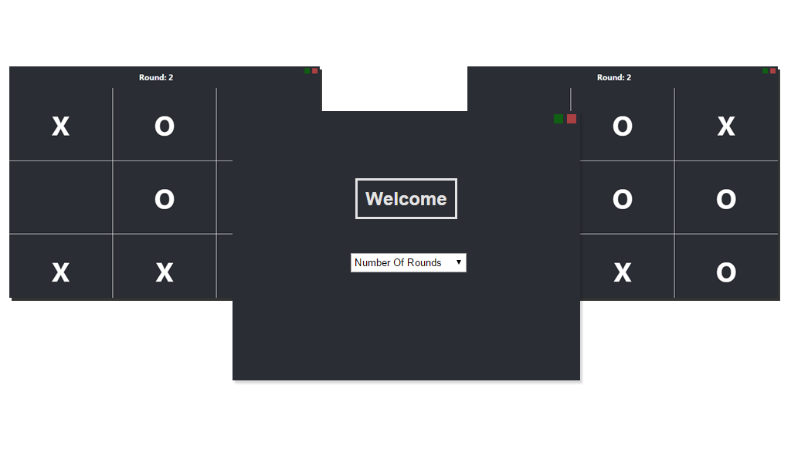

# Tic-Tac-Toe



Tic-Tac-Toe is a chrome packaged app game made using Javascript, HTML5 and CSS.

  - Runnable on all platforms
  - Runs offline
  - Magic?

> Chrome Apps let you use HTML5, CSS, and 
> JavaScript to deliver an experience comparable to a native application.

## Table Of Contents
- [Version] (#version)
- [Installation] (#installation)
- [Getting Started] (#getting-started)
- [Contribute] (#contribute)
- [License] (#license)

## Version
0.1


## Installation
> All you need is your favourite text editor and the Chrome web browser.
~~Chrome Dev Editor is recommended~~

**Chrome Dev Editor is no longer supported by google.**

1. Clone this repo.
2. Navigate to settings in Chrome.
3. Select *Extensions* in the left tab.
4. Tick the *"Developer Mode"* box.
5. Click *"Load unpacked extension..."*
6. Select the git clone file.

> Hit the launch button and you are done!
> The goal is to get this published on the Chrome Web Store!

## Getting Started
It's *dead easy* to get started. Look through the current code to get an understanding of how the app works.
Chrome apps are developed in Javascript, HTML5 and CSS.

Check these useful references out:
- [W3Schools] (http://www.w3schools.com/)
- [Chrome Apps Developer Page](https://developer.chrome.com/apps/about_apps)

## Contribute
Anyone of all abilities are welcome to contribute to this Repo.

1. Fork it.
2. Create a branch | ```sh git checkout -b my_tic_tac_toe ```
3. Commit your changes | ```sh git commit -am "Added an awesome font!" ```
4. Push to the branch | ```sh git push origin my_tic_tac_toe ```
5. Open a Pull Request
6. Sit back and have a Coffee

## License

Copyright (c) 2015 Hywel Martin


Permission is hereby granted, free of charge, to any person obtaining a copy
of this software and associated documentation files (the "Software"), to deal
in the Software without restriction, including without limitation the rights
to use, copy, modify, merge, publish, distribute, sublicense, and/or sell
copies of the Software, and to permit persons to whom the Software is
furnished to do so, subject to the following conditions:


The above copyright notice and this permission notice shall be included in
all copies or substantial portions of the Software.


THE SOFTWARE IS PROVIDED "AS IS", WITHOUT WARRANTY OF ANY KIND, EXPRESS OR
IMPLIED, INCLUDING BUT NOT LIMITED TO THE WARRANTIES OF MERCHANTABILITY,
FITNESS FOR A PARTICULAR PURPOSE AND NONINFRINGEMENT.  IN NO EVENT SHALL THE
AUTHORS OR COPYRIGHT HOLDERS BE LIABLE FOR ANY CLAIM, DAMAGES OR OTHER
LIABILITY, WHETHER IN AN ACTION OF CONTRACT, TORT OR OTHERWISE, ARISING FROM,
OUT OF OR IN CONNECTION WITH THE SOFTWARE OR THE USE OR OTHER DEALINGS IN
THE SOFTWARE.
